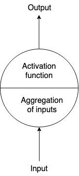

# Deep learning

## Neural Networks

### Normal neuron in feed forward network

* A normal neuron takes multiple inputs which can be aggregated and it passes throught some sort of Activation function like sigmoid, tanh etc. and we have the output.

### Normal neuron in recurrent neural network (RNN)

* A recurrent neuron sends the output back to itself.

* A Recurrent neuron sends the output back to itself, here a neuron will receive inputs from both previous time steps and current time steps. Cells that are a function of inputs from previous time steps are also known as memory cells

* Human's don't start their thinking from scratch every second, they understand the previous words and don't throw everything away, the thought have persistence.

* Traditional NN cannot do this and its a major problem.

* RNN addresses these problems but networks with loops in them and allowing info to persist. A loop allows inf to be passed from 1 step of the network to the next.

* Actually, not that different than normal NN, think as multiple copies of the same network, each can pass a message to a successor.

* RNN are the natural architecture of NN for problems related to sequence and list like, Time series data, sentences, language modeling etc.

* The successor of RNN is LSTM

The idea behind RNN is to connect previous info to the present task:

1. The gap between the relevant info and the place that its needed is **small**:

Sometimes we only need to look at recent info to perform the present task, like for eg. a language model trying to predict the next work based on the previous ones, say in sentence "I love" we don't need any futher context, its pretty obvious the next work is going to be "you" and RNN can learn to use the past info.

2. The gap between the relevant info and the place that its needed is **more**:

Here we need more context. Consider trying to predict the last word in the text "I grew up in Gujarat, ... I speak fluent" recent info suggests that the next work is probably the name of the language (Gujarati), but if we want to narrow down which language, we need the content of Gujarat.

As the gap grows, RNNs are unable to learn to connect the info, and LSTM comes into picture and don't have this problem.

### LSTM

* A special kind of RNN, which is capable of learning long-term dependencies. They are explicity designed to avoid long-term dependency problem.
* Remembering info for long periods of time is their default behavior.

The idea behind LSTM is the cell state:

* Cell state is kind of like a conveyor belt. It runs straight down the entire chain, with only minor linear interactions.
* LSTM does have the ability to add or remove info to the cell state, carefully regulated by structures called gates.
* Gates are a way to optionally let info through. They are composed out of sigmoid neural net layer and a multiplication operation.
* The sigmoid layer outputs numbers between 0 (let nothing throught) and 1 (let everything though).

The LSTM has 3 gates to protect and control the cell state:

1. **Decide what info we're going to throw away from the cell state.** This decision is made by a sigmoid layer called the "forget gate layer". It looks at `H(t-1)` and `X(t)` and outputs a number between 0 and 1 for each number in the cell state `C(t-1)`.

2. **Decide what new info we're going to store in the cell state.** This has 2 parts:

    2.1. A sigmoid layer called the "input gate layer" decides which values we'll update.
    
    2.2. A tanh layer creates a vector of new candidate values `C(t)` that could be added to the state.
    
   Will combine these 2 to create an update to the state.

## Appendix

### Anotations

* NN - Neural Network

* RNN - Recurrent Neural Network

* LSTM - Long Short Term Memory

### References

https://colah.github.io/posts/2015-08-Understanding-LSTMs/
https://towardsdatascience.com/understanding-lstm-and-its-quick-implementation-in-keras-for-sentiment-analysis-af410fd85b47
http://www.bioinf.jku.at/publications/older/2604.pdf
http://karpathy.github.io/2015/05/21/rnn-effectiveness/

