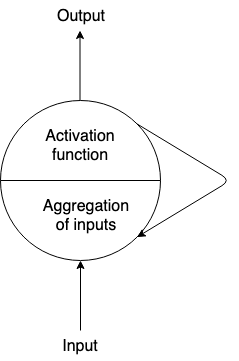
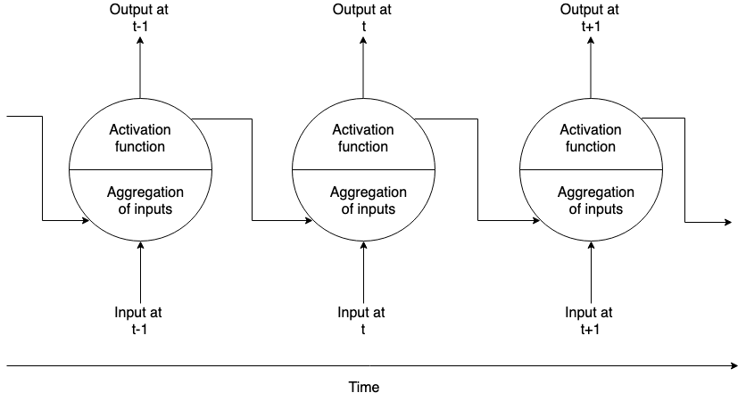
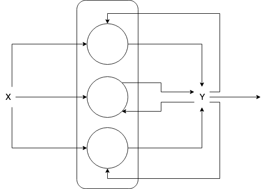
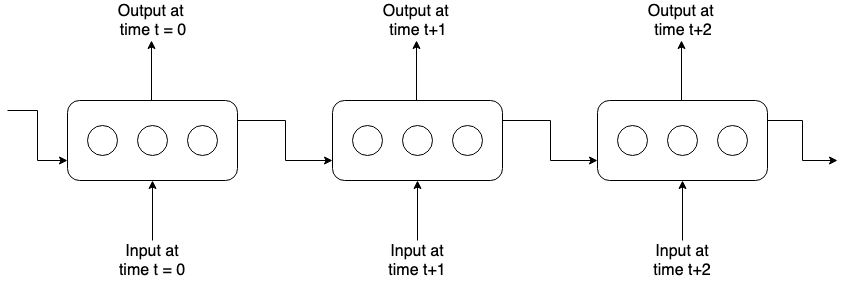

# Deep learning

## Neural Networks

### Normal neuron in feed forward network

* A normal neuron takes multiple inputs which can be aggregated and it passes throught some sort of [Activation function](https://en.wikipedia.org/wiki/Activation_function) like [Sigmoid](https://en.wikipedia.org/wiki/Sigmoid_function), [Tanh](https://en.wikipedia.org/wiki/Hyperbolic_function), [ReLU](https://en.wikipedia.org/wiki/Rectifier_(neural_networks)) etc. and we have the output.

### Recurrent neural network (RNN)

* A recurrent neuron sends the output back to itself.

* Here is how it looks when we unrole a recurrent neuron thoughtout time.

* A neuron will receive inputs from both previous timestamps and current timestamps.

* Here is how the entire layers of recurrent 3 neurons look below, we have input of X, then it goes though the recurrent neurons then we get the output Y and then pass it back in the all the neurons back in that layer.

* Here is how it looks when we unrole the entire layer thoughtout time.

* In recurrent neuron at timestamp t is technically is a function of all the inputs from previous timestamps so it has some form of memory, as we are technically passing in all the historical info to the layer of current neurons. So it persist some kind of state accross neurons in timestamps is called a memory cell.

* Human's don't start their thinking from scratch every second, they understand the previous words and don't throw everything away, the thought have persistence. Traditional neural network cannot do this and its a major problem.

* RNN addresses these problems but networks with loops in them and allowing info to persist. A loop allows info to be passed from one step of the network to the next.

* Actually, not that different than normal neural network, think as multiple copies of the same network, each can pass a message to a successor.

* RNN are the natural architecture of NN for problems related to sequence and list like, Time series data, sentences, language modeling etc.

* RNN are very flexible in their inputs and outputs like

    1. seq-to-seq (sales data shifted over one steps over the future)
    2. seq-to-vector (sentiments score)
    3. vector-to-seq (getting the captions for an image)

The idea behind RNN is to connect previous info to the present task.

#### Vanishing Gradients problem

* Generally, adding more hidden layers tends to make the network able to learn more complex functions, and thus do a better job in predicting future outcomes.

* The problem occures when we do backpropagation ie. moving backward in the network and calculate gradients of loss (error) with respect to the weights, the gradients trends to get smaller and smaller and smaller.

* That means the earlier neurons layers learn very slowly as compared to the neurons in the later layers. Earlier layers are the building blocks and if they are improper then the results will be inaccurate.

* Here the training process will take too long and the prediction accuracy of the model will decrease.

* Sigmoid and Tanh activation functions can cause vanishing gradients problem, hence ReLU (Rectified Linear Unit) based activation functions are prefered in training DL models.

#### Other problems

Another issue with RNN is that after awhile the network will begin to forget the first inputs, as info is lost at each step going throught the RNN. Lets see a use case:

1. The gap between the relevant info and the place that its needed is **small**:

Sometimes we only need to look at recent info to perform the present task, like for eg. a language model trying to predict the next work based on the previous ones, say in sentence "I love" we don't need any futher context, its pretty obvious the next work is going to be "you" and RNN can learn to use the past info.

2. The gap between the relevant info and the place that its needed is **more**:

Here we need more context. Consider trying to predict the last word in the text "I grew up in Gujarat, ... I speak fluent" recent info suggests that the next work is probably the name of the language (Gujarati), but if we want to narrow down which language, we need the content of Gujarat.

As the gap grows, RNNs are unable to learn to connect the info, and LSTM/GRU comes into picture.

### Long short team memory (LSTM)

* A special kind of RNN, which is capable of learning long-term dependencies. They are explicity designed to avoid long-term dependency problem.

* Here is how the network looks

The idea behind LSTM is the cell state:

* Cell state is kind of like a conveyor belt. It runs straight down the entire chain, with only minor linear interactions.
* LSTM does have the ability to add or remove info to the cell state, carefully regulated by structures called gates.
* Gates are a way to optionally let info through. They are composed out of sigmoid neural net layer and a multiplication operation.
* The sigmoid layer outputs numbers between 0 (let nothing throught) and 1 (let everything though).

The LSTM has 3 gates to protect and control the cell state:

1. **Decide what info we're going to throw away from the cell state.** This decision is made by a sigmoid layer called the "forget gate layer". It looks at `H(t-1)` and `X(t)` and outputs a number between 0 and 1 for each number in the cell state `C(t-1)`.

2. **Decide what new info we're going to store in the cell state.** This has 2 parts:

    2.1. A sigmoid layer called the "input gate layer" decides which values we'll update.
    
    2.2. A tanh layer creates a vector of new candidate values `C(t)` that could be added to the state.
    
   Will combine these 2 to create an update to the state.

## Appendix

### Anotations

* NN - Neural Network

* RNN - Recurrent Neural Network

* LSTM - Long Short Term Memory

* RELU - Rectified Linear Unit

### References

https://colah.github.io/posts/2015-08-Understanding-LSTMs/
https://towardsdatascience.com/understanding-lstm-and-its-quick-implementation-in-keras-for-sentiment-analysis-af410fd85b47
http://www.bioinf.jku.at/publications/older/2604.pdf
http://karpathy.github.io/2015/05/21/rnn-effectiveness/
https://medium.com/@anishsingh20/the-vanishing-gradient-problem-48ae7f501257

